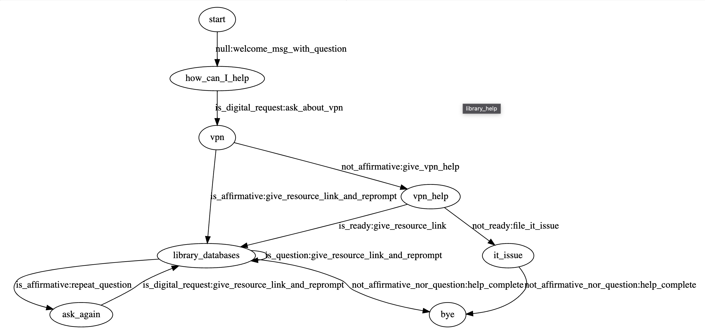

============
fstflowchat
============

**fstflowchat** is a Python library for making dialog systems using
`finite state transducers
<https://en.wikipedia.org/wiki/Finite-state_transducer>`_.

The aims of this project are:

- to make dialog systems that can be visualized as graphs. We
  currently use `graphviz <https://graphviz.org/>`_ for this.

- to make creation of dialogs accessible to students at a graduate or
  advanced undergraduate level.  Currently we use python for this and
  use notebooks as a way to explain the dialog creation process.

- to allow a hybrid of rule-based and machine-learned functionality

.. note::

   This project is under active development and welcomes contributions
   

   
.. toctree::
   :maxdepth: 2

   usage

.. toctree::
   :maxdepth: 2

   notebook_example
