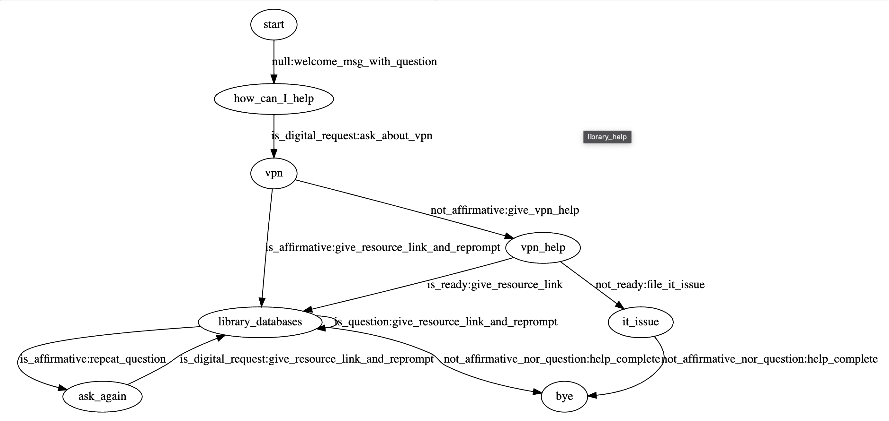

Usage
=====

.. _installation:

Installation
------------

``fstflowchat`` requires ``pygraphviz``.  To install this on a colab notebook use the following commands

.. code-block:: console

   !apt install libgraphviz-dev
   !pip install pygraphviz
   import pygraphviz as pgv

Creating a dialog graph
------------------------

Here is an example dialog graph specified in graphviz.

::

  digraph library_help {
  start -> how_can_I_help                [label="null:welcome_msg_with_question"]
  how_can_I_help -> vpn         [label="is_digital_request:ask_about_vpn"]
  vpn   -> library_databases [label="is_affirmative:give_resource_link_and_reprompt"]
  vpn -> vpn_help [label="not_affirmative:give_vpn_help"]
  #vpn -> vpn [label="not_has_vpn:give_vpn_help"]
  vpn_help -> it_issue [label="not_ready:file_it_issue"]
  vpn_help -> library_databases [label="is_ready:give_resource_link"]
  ask_again -> library_databases [label="is_digital_request:give_resource_link_and_reprompt"]
  library_databases -> bye    [label="not_affirmative_nor_question:help_complete"]
  library_databases -> ask_again [label="is_affirmative:repeat_question"]
  library_databases -> library_databases [label="is_question:give_resource_link_and_reprompt"]
  it_issue-> bye [label="not_affirmative_nor_question:help_complete"]
  }

This will produce a dialog graph that looks like this:

The labels of the edges do most of the work of the dialog. The first
part of the edge label before the ":" is the **transition test
function**. This is the name of a python function that takes a string
input and returns a ``True`` or ``False``. The first transition,
:py:func:`null` returns true for any input:

::

   def null(input_: str) -> bool:
     """this null transition will be true for any arguments, or no input

     It's not quite the same as a null transition in an FST, but it's a
     similar idea

     """
     return True

This null transition sets up the dialog for the dialog system's first
prompt.  The dialog system's output is defined by the second component
of the edge label after the ":", the **transition output function**.
This the name of a python function that takes a string input and
returns a string output.  The string input of the fuction represents
the user's input and the output represents the system's output.
However for the first transition, the input is empty.  The states
represent when the system is waiting for user input.  For the
transition from the first state, we give the dialog system an empty
string as an input.  Sometimes, we don't need the users input,
especially for the output function, but the functions for transition
tests and outputs always have a string input.  Here is a transition
output function that returns the system's initial prompt: "Welcome to
the library, how may I help you?"

::

   def welcome_msg_with_question(input_: str) -> str:
     return "Welcome to the library, how may I help you?" 

For a full example see the notebook...
